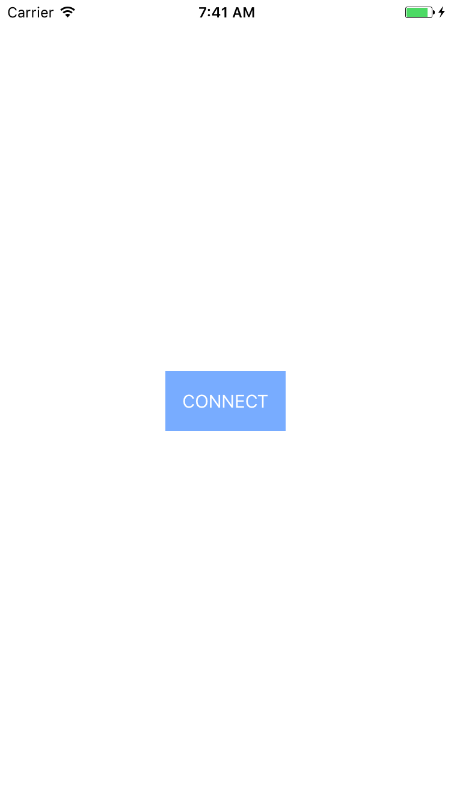
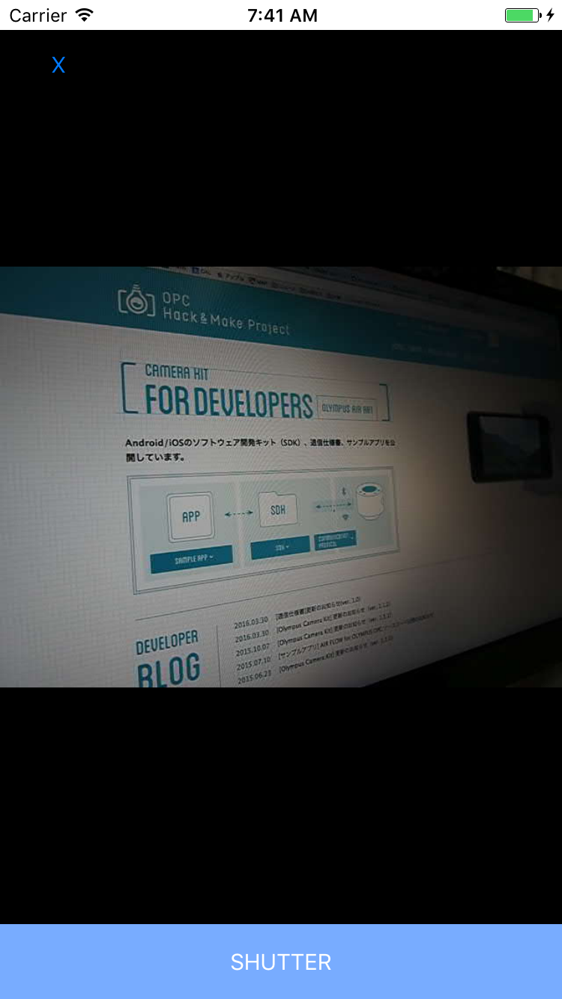

# OLYMPUS AIR A01 SDK OLYCameraKit for Swift3.0

## About
It is the sample code that I made in Swift3.0 for OLYMPUS AIR A01 SDK OLYCameraKit.

[OPC Hack&Make Project For Developers WebSite.](https://opc.olympus-imaging.com/tools/sdk/)([ENG](https://opc.olympus-imaging.com/en/tools/toolssdk/))

## Rec Swift
Live view and still image take picture are possible.

### How to Use
#### STEP1- Connect to Wi-Fi between OLYMPUS AIR A01 and iOS devices 
#### STEP2- Launch RecSwift and tap "Connect button".

#### STEP3- Turn into LiveView screen. You can take picture it when tap "Shutter button".

## Play Swift
Application displays a list of images of the SD card.

